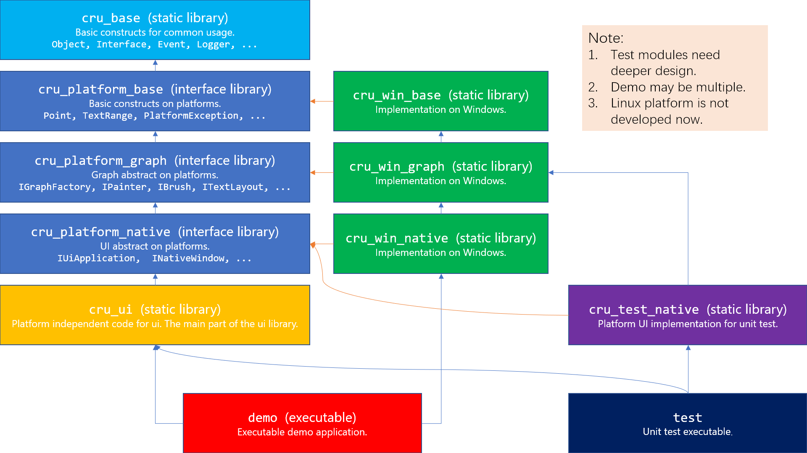

# CruUI

## overview

CruUI is a UI library.

It is **under construction**. It can be built with *CMake*.

## build

Use python3 to run `tool/win_build.py` to build on Windows. Run with `-h` to see the options.

## structure of repository

- `include/` contains public headers.

- `src/` contains the main codes including headers and sources.

- `tools/` contains some codes of tools like code generators.

  - `tools/cppmerge` contains a *python* script program that merges all cpp headers and sources into one **single** header and source. **Not use now**.

  - `tools/build.py` is a python3 script to build the source code.

- `snippets/` contains useful snippets file for *Visual Studio*, you can import it.

- `CMakeSettings.json` is a file that helps *Visual Studio* to config CMake and setup intellisense.

## project structure
Test and Linux module is not developed now.

## jibber jabber
Time: 2019.12.13 2:51

After finishing No.∞ refactor of CruUI at midnight, I would like to jibber jabber about it while waiting for my instant noodles getting "cooked" in boiled water.

Why would I build a GUI library like this?

I started this project because GUI is the first practical area I stepped into in programing, which appeals to me constantly. When I was in high school and began to touch programing, my technology teacher told us GUI is simple as long as you get over algorithm. After quite years, I finally experience programing GUI by myself finding out that it's not true. GUI is the most complicated and error-prone aspect in programing. It has no fixed design and there have been so many splendid framework in GUI such as elegant React (I use it in frontend of my web app Timeline), complicated Angular, innovative Flutter, tradditional Win32 and WinForm, sophisticated WPF, bulky Qt, progressive GTK, original UWP and so on. I'm going to imitate, learn from and conclude from them to improve my design and program capacity. I think it's a fair challenge. What's more, GUI is what you can see with your eyes directly. If I want, I could try to make it beautiful and charmful. I really enjoy fluent and gorgeous animation effect.

Question 2: why C++?

After building my web app in Typescript and C#, I finally find home in C++. It's my "mother" language as I learned it with my first programing book *C++ Primer*. C++ has no virtual machine like most current languages. What about Rust? I admit it is great but it is just too "young", which you may think is my prejudice (however I do love it as well). C++'s feature is diverse and it has no prejudice on the way you should write in. It is inclusive and contains my primary feelings.

Oh, at the end, I have to say that this jibber-jabber is longer than I thought when I let it flow. Well, it's worth it at least, I think. I'll put it here in this project CruUI as one of my colorful memories about it.
