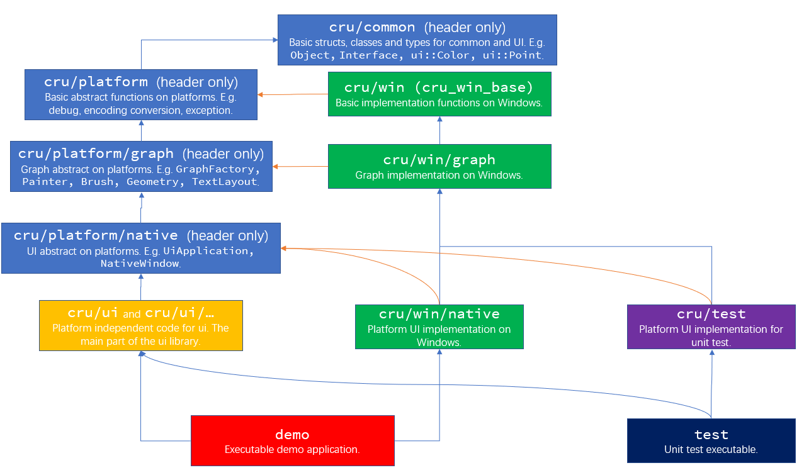

# CruUI

## overview

CruUI is a UI library.

It is **under construction**.

## build

Use python3 to run `tool/build.py`. Run with `-h` to see the options.

## structure of repository

- `include/` contains public headers.

- `src/` contains the main codes including headers and sources.

- `tools/` contains some codes of tools like code generators.

    - `tools/cppmerge` contains a *python* script program that merges all cpp headers and sources into one **single** header and source. **Not use now**.

    - `tools/build.py` is a python3 script to build the source code.

- `snippets/` contains useful snippets file for *Visual Studio*, you can import it.

## project structure

